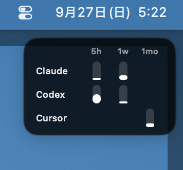
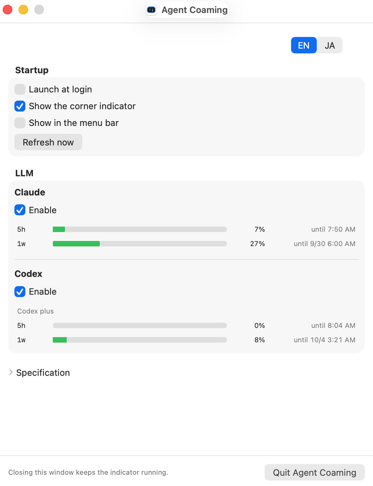

# Agent Coaming

[日本語](README.ja.md)


A macOS app that shows how much of the Claude Code and Codex CLI limits is used, and when they reset. Cursor is not in the default build. It is optional, and only a build with `COAMING_CURSOR=1` includes it.





- This app reads login material and does not rewrite it, copy it, or refresh tokens. The Codex CLI may update its own login file
- This app does not open a connection in the default build. Claude usage comes from local files. Codex usage comes from the local `codex` command, which asks chatgpt.com
- For personal use. Not distributed on the App Store. The GitHub release disk image is notarized. `make install` signs a development build for this Mac

## How it reads usage

| Service | Source |
|---|---|
| Claude | The newer of two local files. (1) `plan-usage-history.json`, written by Claude Desktop about every 15 minutes while you work in Desktop (used percent only). (2) A file written by the bundled script from the `rate_limits` Claude Code passes to its status line, while a Claude Code session runs (includes reset times). OAuth tokens are not touched |
| Codex CLI | Asks the installed `codex` command (`codex app-server`) for `account/rateLimits/read`. The CLI asks chatgpt.com and may refresh its own login file. This app does not read `auth.json` |
| Cursor | Not in the default build. `COAMING_CURSOR=1` compiles in a read-only `state.vscdb` (or the Keychain token) and a call to `cursor.com` |

This app does not use Claude's OAuth token. Anthropic reserves that token for Claude Code and its native apps. The app reads the values Claude Desktop and Claude Code already keep locally.

Cursor does not publish a personal usage API. Reading the local session and polling `cursor.com` sits closest to Cursor's rules against automated access, so the default build leaves Cursor out. `COAMING_CURSOR=1` compiles that path in. Building it is your own decision. The picture above is the default build, with Claude and Codex only.

- **While you work in Claude Desktop (including Cowork), the 5-hour and 7-day percents appear with no extra setup** (written about every 15 minutes; no reset time)
- With Claude Code only, the status line below is what makes the percents and the reset times appear, while a session runs
- This app does not ask Claude for usage. Claude Desktop writes only while you work in it, even if it stays open in the background. The status line writes only while Claude Code runs. When neither is in use, the last value stays on screen, dimmed, with a note such as "Value from 20 hours ago. Claude was not in use."

`plan-usage-history.json` is not a published format, so a Desktop update can make it unreadable. The status line path still works on its own.

## Requirements

- macOS 15 or later, Xcode 16 or later
- [XcodeGen](https://github.com/yonaskolb/XcodeGen) (`brew install xcodegen`)
- An Apple ID (a free Personal Team is enough). The widget uses an App Group, so it will not run unsigned

## Build and install

```sh
COAMING_TEAM_ID=XXXXXXXXXX make install
```

To include Cursor:

```sh
COAMING_CURSOR=1 COAMING_TEAM_ID=XXXXXXXXXX make install
```

`XXXXXXXXXX` is the Team ID shown in Xcode → Settings → Accounts. This installs `~/Applications/Agent Coaming.app` and copies the Claude status line script to `~/Library/Application Support/Agent Coaming/claude-statusline.sh`.

### Claude Code status line (optional, for the CLI only, to show usage and reset times)

Claude Desktop writes the used percents about every 15 minutes while you work in it, without this setting. Those percents have no reset time.

With Claude Code and no Claude Desktop, this setting is what makes usage appear. This app does not ask Claude for usage itself.

**Install the script** on the settings screen copies `claude-statusline.sh` to `~/Library/Application Support/Agent Coaming/`. `make install` copies it to the same place. Then add this to `~/.claude/settings.json`.

```json
{
  "statusLine": {
    "type": "command",
    "command": "~/Library/Application\\ Support/Agent\\ Coaming/claude-statusline.sh"
  }
}
```

If you already have a status line, pass that command as an argument and its display stays.

```json
"command": "~/Library/Application\\ Support/Agent\\ Coaming/claude-statusline.sh ~/.claude/statusline.sh"
```

`command` is executed by a shell, so escape each space in the path with `\` (`\\` inside JSON).

Claude Code writes the usage file the next time it runs the status line and `rate_limits` includes a window. Placing the script does not create the file by itself.

The script writes only `five_hour` and `seven_day` from `rate_limits` to `~/Library/Application Support/Agent Coaming/claude-rate-limits.json`. It does not write conversation text or paths.

## Development

```sh
make test    # unit tests for CoamingCore
make check   # tests plus the forbidden-string check (scripts/check.py)
make run     # build and launch the host
coaming --check  # CLI: whether each service's login material was found
```

## License

MIT
